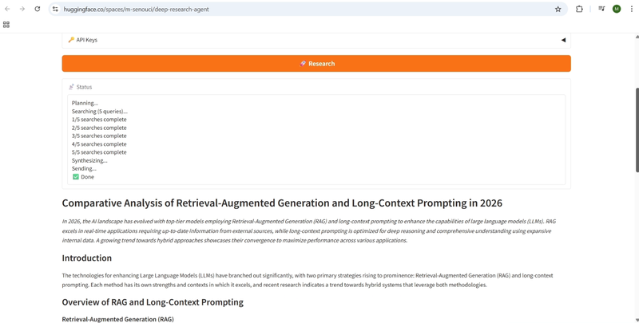

# DeepResearch - Agentic Research Pipeline

[](https://www.python.org/downloads/)
[](https://github.com/openai/openai-agents-python)
[](https://gradio.app/)
[](https://github.com/ma-senouci/deep-research-agent/actions/workflows/test.yml)

DeepResearch is a portfolio project that demonstrates a practical multi-agent research workflow built with the OpenAI Agents SDK. A user enters a research question in a Gradio UI, the system plans searches, runs web research in parallel, synthesizes the results into a structured report, and can optionally send that report by email.

## 🎬 Demo

<a href="https://github.com/ma-senouci/deep-research-agent/releases/tag/v1.0.0">
  
</a>

[Download the full demo video](https://github.com/ma-senouci/deep-research-agent/releases/download/v1.0.0/deepresearch-demo.mp4)

🚀 Live Demo:

[](https://huggingface.co/spaces/m-senouci/deep-research-agent)

Note: The live demo does not include my API keys.
To use the app, provide your own `OPENAI_API_KEY` and, if you want email delivery, an optional `RESEND_API_KEY` through the UI.

## What The App Does

The current application flow is:

1. The user enters a research question in the Gradio UI.
2. The Strategist agent generates a search plan with 3-5 focused queries.
3. Scout agents run those web searches in parallel.
4. The Analyst agent combines the search summaries into a structured markdown report.
5. If a recipient email is provided, the Delivery agent formats the report as HTML and sends it with Resend.
6. The UI streams the pipeline's live step-by-step status updates, then shows the final report and trace link when the run completes.

Notes on the current repo:

- Email delivery is optional. The app always shows the report in the UI.
- A Clarifier agent exists in the codebase, but it is not yet wired into the current UI flow.

## Architecture

```text
User Query (Gradio UI)
        |
        v
Orchestrator
logic_agents/orchestrator.py
        |
        +--> Strategist Agent -> SearchPlan
        |
        +--> Scout Agents x N -> SearchSummary results (parallel via asyncio.gather)
        |
        +--> Analyst Agent -> ResearchReport
        |
        +--> Delivery Agent -> optional HTML email via Resend
        |
        +--> Report + trace link shown in the UI
```

The orchestrator coordinates the pipeline in Python and passes typed data between stages using Pydantic models.

Model choice note: by default, all agents use `gpt-4o-mini`. The Scout agent pairs it with OpenAI's hosted `WebSearchTool` for web retrieval, and the Analyst model can be overridden with `ANALYST_MODEL`.

## SDK Patterns Demonstrated

| Pattern | Where Used | Description |
|---|---|---|
| Multi-agent orchestration | `logic_agents/orchestrator.py` | The pipeline coordinates Strategist, Scout, Analyst, and Delivery agents in sequence. |
| Structured outputs | `models/schemas.py` and all agents | Pydantic schemas are defined in `models/schemas.py` and used by the agents via `output_type=`. |
| Parallel execution | `logic_agents/scout.py` | Scout searches are executed concurrently with `asyncio.gather()`. |
| UI streaming | `app.py` | A status callback streams progress updates back to the Gradio interface. |

## Project Structure

```text
deep-research-agent/
|-- .github/
|   `-- workflows/
|       `-- test.yml
|-- assets/
|   `-- deepresearch-demo-thumbnail.png
|-- logic_agents/
|   |-- __init__.py
|   |-- analyst.py
|   |-- clarifier.py
|   |-- delivery.py
|   |-- orchestrator.py
|   |-- scout.py
|   `-- strategist.py
|-- models/
|   `-- schemas.py
|-- tests/
|   |-- test_analyst.py
|   |-- test_app.py
|   |-- test_clarifier.py
|   |-- test_delivery.py
|   |-- test_orchestrator.py
|   |-- test_schemas.py
|   |-- test_scout.py
|   `-- test_strategist.py
|-- app.py
|-- requirements.txt
|-- requirements-dev.txt
|-- .env.example
`-- README.md
```

Key files:

- `app.py`: Gradio entry point and streaming UI handler.
- `logic_agents/orchestrator.py`: Coordinates the end-to-end research pipeline.
- `logic_agents/scout.py`: Runs web-search scouts in parallel.
- `logic_agents/clarifier.py`: Standalone clarification agent, currently not used by the UI.
- `models/schemas.py`: Shared Pydantic models for agent inputs and outputs.
- `tests/`: Mocked test suite covering pipeline behavior and edge cases.

## Setup

### Prerequisites

- Python 3.11 or newer
- An OpenAI API key
- A Resend API key only if you want email delivery

### Quick Start

```bash
git clone https://github.com/ma-senouci/deep-research-agent.git
cd deep-research-agent

# (Optional) Create environment file
# Mac/Linux:
cp .env.example .env
# Windows PowerShell:
Copy-Item .env.example .env
# Windows cmd:
copy .env.example .env

# (Recommended) Create and activate a virtual environment
python -m venv .venv

# Activate the environment
# Mac/Linux:
source .venv/bin/activate
# Windows PowerShell:
.\.venv\Scripts\Activate.ps1
# Windows cmd:
.venv\Scripts\activate

pip install -r requirements.txt
python app.py
```

The Gradio UI will open locally, usually at `http://localhost:7860`.

## ⚙️ Configuration

You can configure API keys through the UI or with a `.env` file.
Values entered in the UI override matching values loaded from `.env`, so the `.env` file is optional unless you want settings that are only available there, such as `SENDER_EMAIL`.

### 🔑 API Keys

- `OPENAI_API_KEY` — **required** to run the pipeline; can be provided in the UI or in `.env`.
- `RESEND_API_KEY` — **optional**; only needed for email delivery.

### 📧 Email Settings

- `SENDER_EMAIL` — **optional**; used for email delivery.
- If unset, Resend defaults to `onboarding@resend.dev`.

## Running Tests

Install both runtime and development dependencies before running the test suite:

```bash
pip install -r requirements.txt
pip install -r requirements-dev.txt
pytest tests/
```

The test suite is mocked and does not require real OpenAI or Resend credentials. In restricted environments, you may still see non-fatal tracing warnings from the SDK.

## Environment Variables

| Variable | Required | Used By | Description |
|---|---|---|---|
| `OPENAI_API_KEY` | Yes | All agents | Required for model inference and web search. |
| `RESEND_API_KEY` | No | `logic_agents/delivery.py` | Required only if you want email delivery. |
| `ANALYST_MODEL` | No | `logic_agents/analyst.py` | Optional override for the Analyst agent model. Defaults to `gpt-4o-mini`. |
| `RECIPIENT_EMAIL` | No | `logic_agents/delivery.py` | Optional fallback recipient used by `run_delivery()` when it is called without an explicit email. In the current Gradio app flow, email delivery only runs when a recipient is entered in the UI. |
| `SENDER_EMAIL` | No | `logic_agents/delivery.py` | Sender address for Resend. Defaults to `onboarding@resend.dev` if unset. |

## Testing Coverage

The repository currently includes tests for:

- agent wrappers and error handling
- orchestrator success, failure, and recovery paths
- scout parallel execution, progress updates, and partial-failure handling
- delivery behavior with and without Resend configuration
- app-level streaming, API key handling, trace link output, and sanitized errors
- selected schema validation

## Planned Improvement

A Clarifier agent is already implemented and is intended for a future version of the app. In that flow, the user will submit an initial query, the Clarifier will ask three targeted follow-up questions, and the Strategist will then receive both the original query and the user's answers before generating the search plan.

## Why This Repo Is Useful

This project is a strong example of agent engineering patterns that are more realistic than a single prompt-and-response demo:

- typed handoffs between agents
- orchestration outside the model
- concurrent tool-backed research steps
- graceful degradation when some search steps fail
- a simple UI layer that streams progress to the user

## License

MIT License.
